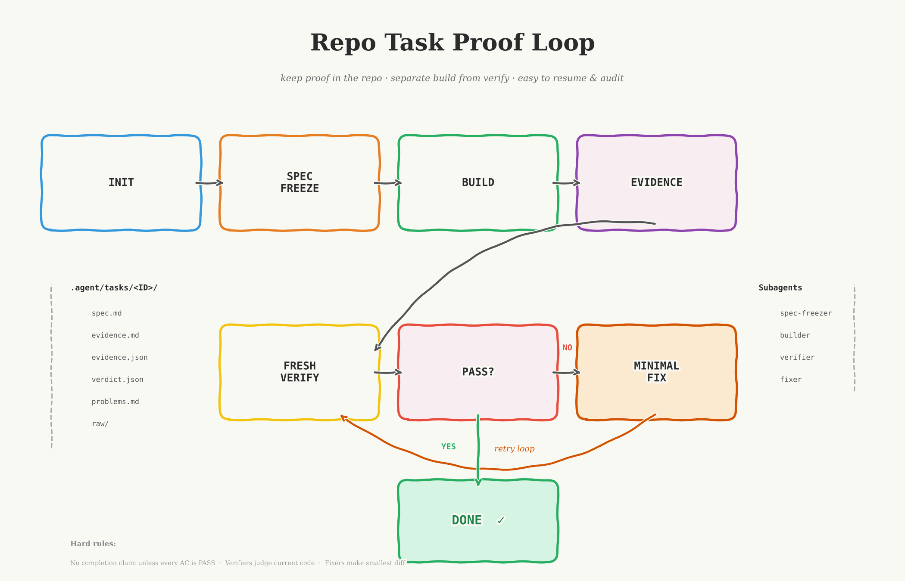

# Repo Task Proof Loop

This skill was built from [OpenClaw-RL: Train Any Agent Simply by Talking](https://arxiv.org/html/2603.10165v1) and applies its proven approach to agentic flows in a repo-local workflow.

> "next-state signals are universal, and policy can learn from all of them simultaneously."

Repo Task Proof Loop is a repo-local workflow skill for non-trivial coding tasks.

It creates a durable task folder under `.agent/tasks/<TASK_ID>/`, installs project-scoped Codex and Claude subagents, updates repo guidance, and drives a strict loop:

`spec freeze -> build -> evidence -> fresh verify -> minimal fix -> fresh verify`

For Codex, that loop also supports an adaptive bounded fan-out path for `explorer` or `worker` children when the task splits cleanly.

The point is simple: keep proof inside the repository, separate implementation from verification, and make task state easy to resume or audit later.



## What It Creates

Inside the target repository:

```text
.agent/tasks/<TASK_ID>/
  spec.md
  evidence.md
  evidence.json
  raw/
    build.txt
    test-unit.txt
    test-integration.txt
    lint.txt
    screenshot-1.png
  verdict.json
  problems.md

.codex/agents/
  task-spec-freezer.toml
  task-builder.toml
  task-verifier.toml
  task-fixer.toml

.claude/agents/
  task-spec-freezer.md
  task-builder.md
  task-verifier.md
  task-fixer.md
```

It also inserts managed workflow blocks into:

- the repo-root `AGENTS.md` Codex baseline
- the repo's Claude guide file: `CLAUDE.md` or `.claude/CLAUDE.md`

## Install

Install the skill as a project skill.

### Codex

```text
.agents/skills/repo-task-proof-loop/
```

### Claude Code

```text
.claude/skills/repo-task-proof-loop/
```

If you use both tools on the same repository, install it in both locations or keep one canonical copy and sync it.

## Quick Prompts

Use this prompt for the normal flow:

### Do Task

```text
Use $repo-task-proof-loop to do the task described below in this repository. Reuse the matching repo-local task if it already exists; if not, initialize it first and then continue automatically after init completes. You are explicitly authorized to use subagents and bounded parallel helper work when it materially helps. Choose the best internal orchestration automatically from the current task shape and tool surface. Keep the proof-loop phase explicit as you work so matching project agents can be picked automatically when the product supports that, otherwise continue on the main thread. Keep the task tree shallow, keep one integration builder responsible for evidence, and keep every verifier pass fresh.
...
```

For all prompts, replace `...` with either `Task file: <path/to/task-file.md>` on the next line or the task text pasted on following lines.

This skill is intentionally proof-first, so `init` always comes before build.

For users, the intended interaction stays simple: run Codex, mention `$repo-task-proof-loop`, and describe the task. Use `Do Task` for the normal end-to-end flow; it can initialize first when needed, keep the phase cues clear enough for Claude-style auto-delegation, and still lets the skill choose serial, subagent, or bounded parallel execution internally for Codex and other agents.

## Quick Start

1. Install the skill in the repository.
2. For the normal end-to-end flow, run `Do Task`.
3. In Claude Code, if `init` just created or refreshed `.claude/agents/*`, do not assume those agents are immediately available in the current session.
4. `Do Task` should reuse the matching task when it exists and initialize first when it does not.
5. If you intentionally want init without continuing, run `scripts/task_loop.py init` directly.
6. Validate before sign-off, but only after `init` has fully finished.

## Codex Notes

- The initializer manages the repo's `AGENTS.md` block directly. Use Codex CLI `/init` only if you want Codex to draft a generic `AGENTS.md` outside this workflow.
- If `init` creates or rewrites `AGENTS.md` during a running Codex session, start a new Codex session before relying on the updated instructions.
- Do not run `validate` or `status` in parallel with `init`. Wait for `init` to finish, then inspect the seeded files.
- Root `AGENTS.md` is the repo-wide baseline for this skill. Nested `AGENTS.override.md` or `AGENTS.md` files closer to the files you touch still take precedence.
- In Codex, the default loop is still flat: spawn one role child at a time when that is enough, reuse the live builder child for evidence via follow-up instructions, and use a fresh verifier child on every verify pass. A fixer can be fresh by choice; freshness is only required for the verifier.
- For broad Codex tasks, bounded fan-out is available only after the user explicitly asks for delegation or parallel agent work. Once authorized, the skill can choose the child roles and whether bounded fan-out is warranted; users do not need to name specific subagents or manual slash commands.
- Keep Codex helper fan-out modest and wave-based. Prefer up to 3 parallel helper children at once, then wait before moving to the next phase.
- Keep the Codex task tree shallow even in the broader-task fan-out path. The parent session should orchestrate all children directly, one integration builder should own `evidence.md` and `evidence.json`, and one fresh verifier should own `verdict.json`.
- Before reusing or resuming a Codex child, inspect the current child-thread list with `/agent` in the CLI or the equivalent child-thread inventory surface exposed by the current Codex product surface.
- The Codex todo/checklist UI comes from `update_plan`. It is useful for live progress display, but it is session-scoped and not the durable state for this workflow.
- Codex CLI surfaces such as `/agent`, `/status`, and `/review` are operator tools, not prerequisites for normal use of this workflow.
- The guidance-source list seeded into `spec.md` is a workflow input list, not a claim about Codex automatic guide loading. Codex natively auto-loads in-scope `AGENTS.override.md`, `AGENTS.md`, and any configured fallback filenames.

## Helper Script

The bundled helper script currently ships three CLI commands:

- `init` - create the repo-local task folder, artifacts, guides, and subagents
- `validate`
- `status` - inspect an existing initialized task

The workflow phases `freeze`, `build`, `evidence`, `verify`, `fix`, and `run` are skill-level commands for the agent, not direct CLI subcommands in this package.

Set `SKILL_PATH` to the installed skill directory:

### Codex example

```bash
SKILL_PATH=.agents/skills/repo-task-proof-loop
```

### Claude Code example

```bash
SKILL_PATH=.claude/skills/repo-task-proof-loop
```

Initialize a task:

```bash
python3 "$SKILL_PATH/scripts/task_loop.py" init \
  --task-id feature-auth-hardening \
  --task-file docs/tasks/auth-hardening.md
```

Or seed from inline text:

```bash
python3 "$SKILL_PATH/scripts/task_loop.py" init \
  --task-id feature-auth-hardening \
  --task-text "Implement auth hardening for session refresh and logout."
```

Validate:

```bash
python3 "$SKILL_PATH/scripts/task_loop.py" validate \
  --task-id feature-auth-hardening
```

Run `validate` only after `init` completes. If it reports initialization in progress, wait and rerun.

Status:

```bash
python3 "$SKILL_PATH/scripts/task_loop.py" status \
  --task-id feature-auth-hardening
```

Use `status` after `init` completes when you want stable task state. If it returns `init_in_progress: true`, retry after `init` finishes.

Useful options:

- `--guides auto|agents|claude|both|none`
- `--install-subagents both|codex|claude|none`
- `--force`

With `--guides auto`, the initializer preserves existing guide files, but it also ensures `CLAUDE.md` exists whenever Claude agents are being installed and `AGENTS.md` exists whenever Codex agents are being installed.

## Claude Notes

- Claude Code should normally let the main session choose the installed project agents under `.claude/agents/` automatically based on the task and their descriptions.
- If `init` created or refreshed `.claude/agents/*` during the current Claude Code session, do not assume those refreshed agents are immediately available.
- For this workflow, the default Claude path is to reuse the same builder child for evidence. Only fall back to a second builder in evidence-only mode if the original builder session is unavailable.
- For this workflow, keep the Claude path flat: the main session may auto-delegate each phase, but the workflow agents themselves are not meant to spawn more agents.
- Claude may also use TodoWrite or show a task/todo UI for multi-step work. That UI is useful for live session progress, but the canonical durable workflow state is always the repo-local artifact set under `.agent/tasks/<TASK_ID>/`.

## Validation

The package includes a smoke test:

```bash
python3 "$SKILL_PATH/scripts/verify_package.py"
```

It checks the skill structure, initializes temporary repositories, installs the task artifacts and subagents, and verifies the generated task bundles and guide behavior.

## More Detail

The exact role prompts and platform-specific guidance live in:

- `references/COMMANDS.md`
- `references/SUBAGENTS.md`
- `references/REFERENCE.md`
- `SKILL.md`
